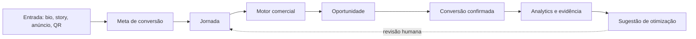

# Sobe

Sobe is presence and conversion infrastructure for social traffic.

A business can publish a branded commercial presence, landing pages or direct conversion journeys. Content and CTAs connect to conversion goals that execute qualification, quotes, bookings, orders, reservations, routing and other measurable commercial actions.

**Presence → Intent → Action → Opportunity → Conversion.**

> **Sobe não é onde seus links ficam. É onde a intenção vira ação.**

## Modelo do produto



O agregado técnico continua sendo `Project`; na interface ele é chamado de **Negócio**. Metas e entradas não substituem as etapas. Oportunidades não substituem leads, orçamentos, agendamentos, pedidos ou reservas: elas unificam esses objetos para operação e analytics.

## Capacidades preservadas

- qualificação e recomendação;
- orçamento nativo;
- agenda e disponibilidade;
- catálogo e pedidos;
- reservas;
- roteamento por regras, localização e unidade;
- pagamento externo;
- publicação versionada, mídia, fontes, notificações, analytics, Supabase e RLS.

## Desenvolvimento local sem login

```bash
npm ci
cp .env.example .env.local
```

No `.env.local`, habilite:

```dotenv
ENABLE_LOCAL_DEV_AUTH=true
NEXT_PUBLIC_ENABLE_LOCAL_DEV_STORE=true
NEXT_PUBLIC_APP_NAME=Sobe
NEXT_PUBLIC_PUBLIC_BASE_URL=http://localhost:3000
```

Depois execute:

```bash
npm run dev -- --hostname 127.0.0.1 --port 3000
```

O modo local usa `localStorage` e dados explicitamente demonstrativos. Em produção, desative o store local e configure Supabase.

## Banco e segurança

As novas entidades estão em migrações aditivas:

- `202608110020_conversion_goals_entry_points.sql`
- `202608110021_conversion_attribution.sql`
- `202608110022_commercial_opportunities.sql`
- `202608110023_optimization_suggestions.sql`
- `202608110024_presence_pages.sql`
- `202608110025_presence_entry_points.sql`
- `202608110026_presence_attribution.sql`
- `202608110027_presence_save_publish.sql`
- `202608110028_presence_optimization.sql`

Todas as tabelas privadas usam RLS por workspace; metas e entradas só têm leitura anônima quando pertencem a um negócio publicado. Chaves estrangeiras e colunas usadas por RLS/analytics possuem índices dedicados.

## Atribuição

Precedência: UTM explícita da URL → UTM padrão da entrada → referrer → direto. O runtime registra `conversionGoalId`, `entryPointId` e `destinationId`. Preview nunca persiste eventos.

## Oportunidades e receita

Formulário, orçamento, agendamento, pedido, reserva e contato roteado com contexto criam oportunidades idempotentes por `project_id + source_type + source_id`. Receita só entra no analytics quando uma pessoa marca a oportunidade como convertida e informa o valor confirmado.

## Analytics e otimização

O funil macro é: **Atenção → Intenção → Ação → Oportunidade → Conversão**. Não existem percentuais ou comparações fictícias. Sem período anterior válido, a interface mostra “Sem comparação ainda”. Sugestões determinísticas exigem pelo menos 30 sessões no negócio e 15 na meta; nunca são publicadas automaticamente.

## Backfills

```bash
npm run data:backfill:conversion-goals:dry
npm run data:backfill:conversion-goals
npm run data:backfill:opportunities:dry
npm run data:backfill:opportunities
npm run data:check-consistency
npm run data:presence:check
```

Os scripts são idempotentes e o modo dry-run não grava dados.

## Verificação

```bash
npm run lint
npm run typecheck
npm run test
npm run test:e2e
npm run build
```

Para validar o mesmo conjunto de verificações usado antes de um deploy:

```bash
npm run production:env
npm run production:check
```

`production:env` valida URLs HTTPS, Supabase, OpenAI, rate limit distribuído, segredos, cron e provedores habilitados sem imprimir os valores. Em produção, configure essas variáveis diretamente no provedor de hospedagem; arquivos `.env` permanecem ignorados pelo Git.

O modelo padrão é `gpt-5.4-mini-2026-03-17` para texto e visão. O snapshot fixo evita mudanças inesperadas de comportamento entre deploys, mantém saída estruturada e usa esforço de raciocínio baixo para controlar custo e latência.

## Limites atuais

Ficam fora do escopo: WhatsApp Cloud/bots, CRM avançado, gerenciador de anúncios, ERP/estoque, novo billing, domínios customizados, A/B estatístico, automação de e-mail e marketplace. A Sobe pode montar contexto e abrir um link do WhatsApp, mas não afirma enviar ou automatizar mensagens.
