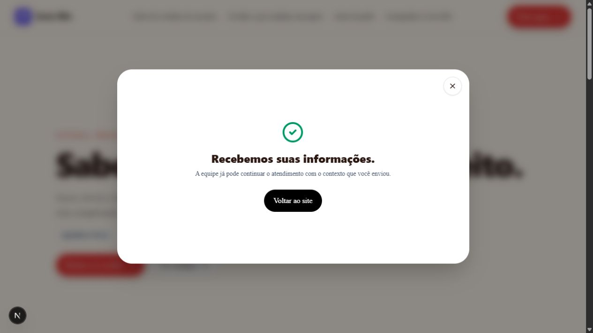

# Sobe — teste funcional de 02/09/2026

## Resultado e alcance

Foram aprovados **370 testes unitários**, **45 testes de ponta a ponta** e **7 testes de isolamento entre contas no Supabase real**: **422 testes aprovados**. Um caso de quebra de texto, específico de celular, foi ignorado na execução de desktop conforme a configuração do próprio teste.

Isso não significa cobertura de 100% da Sobe. Não foi coletada cobertura de código, não foi fornecido/localizado o endereço publicado e parte das integrações reais ainda não está configurada para teste. A versão publicada não foi certificada nesta execução.

Os testes de navegador usam Chromium com perfis Pixel 7 e Desktop Chrome, servidor Next.js de desenvolvimento, autenticação/store local e IA simulada. Roteamento por CEP e determinados endpoints de ativação/WhatsApp são simulados nos testes existentes. Os resultados desses testes não comprovam execução dos respectivos provedores em produção.

## Matriz de validação

| Área | Resultado | Evidência/limite |
|---|---|---|
| Regras, contratos e serviços | 370/370 aprovados em 61 arquivos | `npm test` |
| Experiência em celular e computador | 45 aprovados, 1 ignorado | `npm run test:e2e -- --reporter=list,html` |
| Isolamento entre contas | 7/7 aprovados | `npm run test:integration:rls`, Supabase real configurado para QA |
| Lint | Aprovado | Etapa inicial de `npm run verify` |
| TypeScript | Aprovado após regeneração de cache | Dois arquivos em `.next/dev/types` estavam corrompidos; removidos somente os arquivos gerados |
| Build | Aprovado | `npm run build`, compilação e geração de rotas concluídas |
| Validação de ambiente de produção | Reprovada no ambiente local | Não é inspeção das variáveis remotas da Vercel |
| Integração de conversão persistida | Não executada | Faltam `INTEGRATION_TEST_SUPABASE_URL`, `INTEGRATION_TEST_SUPABASE_SERVICE_ROLE_KEY`, `INTEGRATION_TEST_USER_ID` |
| Agenda com banco real | Não executada | Requer variáveis de integração e `SCHEDULING_TEST_ALLOW_REMOTE=true` |
| Cadastro, confirmação de e-mail, recuperação e login reais | Não concluídos ponta a ponta | A navegação manual confirmou a chegada ao cadastro; não houve criação de conta real |
| Cobrança real e webhook financeiro | Não executados | Testes unitários não equivalem a uma cobrança real |
| IA online | Não executada | Suíte E2E usa `ACTIVATION_GATE_FAKE_AI=true` |
| Página publicada | Pendente de endereço público | Os endereços locais configurados são `http://localhost:3000` |

## Fluxos percorridos pelos testes de navegador

- Onboarding: análise, revisão, geração de rascunho, abertura do editor, recuperação de sessão inválida, retomada após refresh, nova sessão e validação de WhatsApp.
- Editor: edição simples/avançada, alteração do texto e da ação, persistência da alteração e proposta de IA sob confirmação.
- Página pública: conteúdo inicial no HTML, SEO/canonical/dados estruturados, menu de celular, abertura do atendimento e títulos longos em 360, 375 e 390 pixels.
- Orçamento: serviço → quantidade → contato → revisão → confirmação.
- Qualificação: intenção → respostas B2B → recomendação.
- Entrada direta: resolução de meta e precedência das UTMs da URL.
- Pedido: delivery → unidade → catálogo → carrinho → confirmação local.
- Agendamento: serviço → equipe → data → horário → contato → confirmação local.
- Reserva: período → disponibilidade → acomodação → contato → solicitação local.
- Multiunidade: consentimento → CEP → unidade recomendada → destino de WhatsApp; resposta geográfica simulada.
- Ativação: benefício → identidade → jornada → abertura do destino de WhatsApp; endpoints de claim/handoff e destino externo simulados.
- Geração SonoLeve: coerência entre ofertas, perguntas e página gerada; validação de contrato com IA simulada.

## Roteiro para ver o fluxo como visitante

O endereço abaixo é uma **demonstração local**, acessível enquanto o servidor estiver ativo neste computador. Não é publicação na internet.

1. Abra [a demonstração Casa Mix](http://127.0.0.1:3100/virou-presenca-demo).
2. Clique em **Montar meu pedido**. O atendimento abre dentro da página.
3. Escolha **Delivery**.
4. Na etapa da unidade, clique em **Ver produtos**.
5. Adicione **Suco natural — R$ 12,00**.
6. Escolha **Entrega** e confira o carrinho.
7. Clique em **Enviar pedido** e confira a confirmação local.

O teste automatizado percorreu a jornada equivalente na rota `/casadesucosmix` e confirmou “pedido enviado com sucesso” em celular e computador. A navegação manual percorreu a entrada pela página `/virou-presenca-demo`, adicionou um suco de R$ 12,00, selecionou entrega, enviou o pedido e confirmou a tela **“Recebemos suas informações.”**. Trata-se de uma transação de demonstração local.

Para conhecer a plataforma: [página inicial local](http://127.0.0.1:3100/) → **Ver como funciona** → simulação → **Começar 7 dias grátis** → cadastro. A navegação manual confirmou a âncora da seção e o destino `/register?next=/app/onboarding`.

## Problemas e pendências relevantes

### P1 — Sem validação do ambiente publicado

Não há URL pública configurada nos arquivos examinados nem vínculo `.vercel/project.json` no checkout. Isso não prova que não exista publicação: impede confirmar qual deploy corresponde a este código. É necessário o link público para testar chegada anônima, assets, redirecionamentos, autenticação e conversão no ambiente remoto.

### P1 — Gate de produção local falha

`npm run production:env` apontou ausência de `RATE_LIMIT_SECRET`, `CRON_SECRET`, `CUSTOMER_IDENTITY_HASH_SECRET`, `RESEND_API_KEY`, `EMAIL_FROM`, `GOOGLE_MAPS_SERVER_API_KEY` e `NEXT_PUBLIC_GOOGLE_MAPS_BROWSER_KEY`, além de URLs sem HTTPS. O gate exige os provedores habilitados no ambiente carregado. A configuração da Vercel pode ser diferente e não foi lida. Não publicar utilizando esses valores locais sem resolver o gate.

### P2 — Erros auxiliares não reprovam a suíte E2E

Os logs registraram `authenticated_route_failed` em `/api/product-state/surface` e `/api/projects/<id>/optimization` mesmo com os testes de UI aprovados. Há duas causas identificáveis no modo local:

- `src/app/api/product-state/surface/route.ts`: valida `projectId` como UUID antes de retornar para persistência em memória; fixtures como `demo-casa-sucos` não são UUIDs.
- `src/server/optimization/optimization-service.ts`: no modo em memória, procura o projeto somente em `demoProjects`; projetos gerados durante o onboarding não pertencem à lista fixa.

Impacto: parte das telas pode funcionar enquanto marcadores de uso ou a consulta de otimização falham. A suíte atual não exige ausência de erros em todas as requisições auxiliares. Não foi verificado se esses problemas ocorrem em produção com IDs e persistência reais.

### P2 — Evidência insuficiente para aprovação integral de integrações

Conversão persistida e agenda com banco real não foram executadas. Também faltam comprovações de login/e-mail, IA online, cobrança, notificações e mapas reais. Preparar os ambientes/contas de teste correspondentes e executar esses fluxos antes de declarar aprovação de produção.

## Revisão da interface

Amostra visual: landing, cadastro e atendimento da demonstração. A suíte verificou layout de títulos e menu responsivo. O detector Impeccable examinou marketing e experiência pública; a pasta `src/components/auth` não existe, portanto não foi examinada por esse caminho.

| Dimensão | Avaliação desta execução |
|---|---|
| Acessibilidade | Controles e campos principais têm nomes acessíveis; não foi feita certificação WCAG, auditoria completa de contraste ou de leitor de tela |
| Performance | Conteúdo público no HTML confirmado; sem medição de Core Web Vitals em produção |
| Responsividade | Casos automatizados de celular e desktop aprovados, inclusive títulos longos na amostra |
| Temas | Sistema existente preservado; detector encontrou tamanhos e cores literais para revisão contextual |
| Integridade | Jornadas principais coerentes; erros auxiliares locais limitam aprovação integral |

Não atribuí nota global à aplicação sem medir as áreas restantes. O alerta do detector sobre a faixa de 3px em `.pricingOffer::before` não foi classificado como defeito funcional: a faixa usa o gradiente da marca e é compatível com a identidade documentada. Outros avisos mecânicos não foram tratados como bugs sem reprodução de impacto.

## Próximos passos

1. Informar o link público e validar o deploy correto.
2. Resolver configuração de teste das integrações reais e avaliar o gate remoto de produção.
3. Corrigir os erros auxiliares do modo local e verificar que as requisições relevantes também passam.
4. Completar a auditoria de acessibilidade e performance do ambiente publicado. Para ajustes de interface, usar `impeccable harden`/`impeccable adapt` conforme o problema e `impeccable polish` apenas ao final.

Nenhum código de produto foi alterado nesta auditoria. A modificação preexistente em `src/features/ai-setup/architecture-materialization.ts` foi preservada.

## Evidências salvas

- `qa-assets/2026-09-02/qa-unit.log`: 370 testes unitários.
- `qa-assets/2026-09-02/qa-e2e.log`: 45 testes de navegador e erros auxiliares observados.
- `qa-assets/2026-09-02/qa-typecheck.log` e `qa-build.log`: validações finais aprovadas.
- `qa-assets/2026-09-02/qa-verify.log`: primeira tentativa, incluindo o erro nos tipos gerados antes da limpeza.
- `qa-assets/2026-09-02/qa-ui-audit.json`: saída bruta do detector, que contém avisos não confirmados como defeitos.
- `qa-assets/2026-09-02/pedido-confirmado.png`: confirmação do percurso manual.
- `playwright-report/index.html`: relatório interativo da suíte E2E; diretório ignorado pelo Git.
